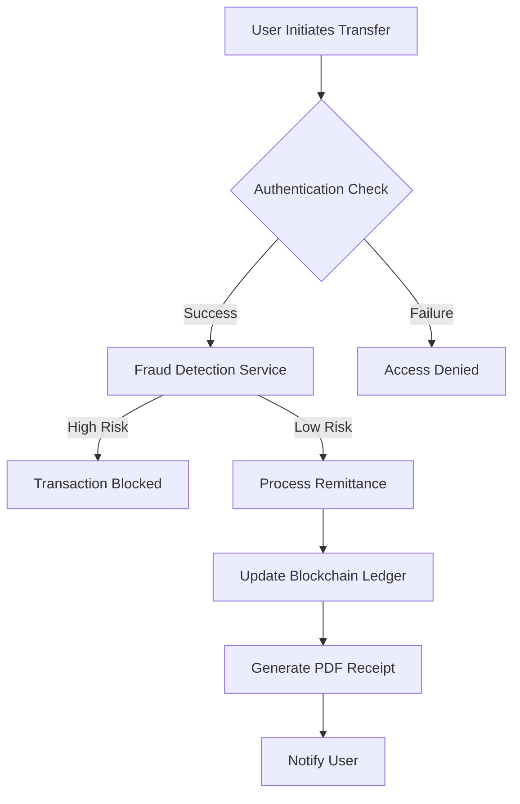

# mscblockchain cat <<EOF > README.md
# mscblockchain

mscblockchain (RemitChain) is a professional-grade, blockchain-powered remittance platform designed to send money across borders fast, fair, and transparently.

## Key Features

- Fraud Detection: Integrated AI-driven fraud analysis service.
- Secure Remittance: Robust cross-border payment flow with blockchain transparency.
- Automated Reporting: On-the-fly PDF generation for transaction receipts.
- Professional Architecture: Clean separation of concerns with a dedicated service layer.
- Comprehensive Testing: Full suite of unit and integration tests ensuring reliability.

## Remittance Flow

Below is a high-level overview of how a transaction flows through the system:

## Architecture

This project follows a modern, service-oriented architecture. Core business logic is decoupled from the UI layer to ensure maintainability and testability.

For a detailed breakdown, see our [Architecture Documentation](./ARCHITECTURE.md).

## Security

Security is a top priority for mscblockchain. We implement several layers of protection:
- Authentication: Secure user management via Supabase.
- Route Protection: Next.js middleware for session verification.
- Risk Analysis: Pre-transaction fraud detection service.
- Data Integrity: Blockchain-backed ledger for immutable transaction records.

To report a security vulnerability, please see our Security Policy (coming soon) or open a confidential issue.

## Getting Started

To get the project up and running locally, please follow the instructions in the [Quickstart Guide](./QUICKSTART.md).

## Contributing

We welcome contributions! Please see our [Contributing Guidelines](./CONTRIBUTING.md) for more information on how to get started.

## License

This project is licensed under the MIT License - see the [LICENSE](./LICENSE) file for details.

---

Built with Next.js, Prisma, Shadcn/UI, and Ethers.js.
